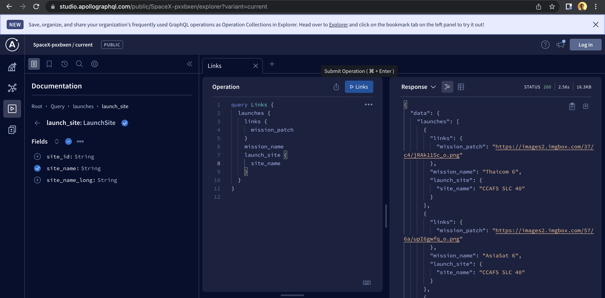
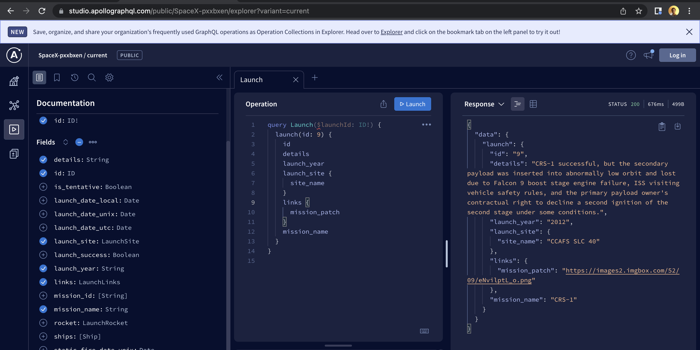

# Space-X
Space-X is an android application that displays the list of launches from the [Space-X API](https://rawg.io/) using [ApolloGraphql](https://www.apollographql.com/)inclusive of their launch site and mission name respectively.Built  entirely using kotlin among other [Android Architecture Compoonents](https://developer.android.com/topic/architecture)

## queries used.
The app queries(in this case [queries](https://github.com/kanake10/Space-X/tree/main/app/src/main/graphql/com/example/spacex/) are used to read or fetch values while a mutation is used to write or post values returning a response in json format.The [sampledata](https://github.com/kanake10/Space-X/tree/main/app/sampledata/) directory too indicates the sample response.

- An example of the single launch query that showcases more information on the launch,this query has a passed argument:
 ```json
{
  "data": {
    "launch": {
      "id": "9",
      "details": "CRS-1 successful, but the secondary payload was inserted into abnormally low orbit and lost due to Falcon 9 boost stage engine failure, ISS visiting vehicle safety rules, and the primary payload owner's contractual right to decline a second ignition of the second stage under some conditions.",
      "launch_site": {
        "site_name": "CCAFS SLC 40"
      },
      "launch_success": true,
      "launch_year": "2012",
      "links": {
        "mission_patch": "https://images2.imgbox.com/52/09/eNvilptL_o.png"
      }
    }
  }
}
 ```
   
 Enjoy writing your queries here. :point_down:
 
 [plaground for writing Apollo queries](https://studio.apollographql.com/login?from=%2F/)
 
 ## Technologies used
 
   * [Hilt](https://dagger.dev/hilt//) - Dependency Injection library 
   * [Apollo client](https://www.apollographql.com/docs/react/) - Apollo Client
   * [Graphql](https://graphql.org/) - Apollo Client
   * [ViewBinding](https://developer.android.com/topic/libraries/view-binding) a feature that allows you to more easily write code that interacts with views. Once view binding is enabled in a module, it generates a binding class for each XML layout file present in that module.
   * [Coil](https://coil-kt.github.io/coil/) An image loading library for Android backed by Kotlin Coroutines. 
   * [Data Binding](https://developer.android.com/topic/libraries/data-binding) - Data Binding library 
   * [Lottie](https://lottiefiles.com/)
   *[ViewModel](https://developer.android.com/topic/libraries/architecture/viewmodel) - Designed to store and manage UI-related data in a lifecycle conscious way. The ViewModel class allows data to survive configuration changes such as screen rotations.
   * [Coroutines](https://github.com/Kotlin/kotlinx.coroutines) - Library Support for coroutines.
   * [Navigation Component](https://developer.android.com/guide/navigation/navigation-getting-started)-Component that allows easier implementation of navigation from simple button clicks to more complex patterns.
   * [Android KTX](https://developer.android.com/kotlin/ktx.html) - Provide concise, idiomatic Kotlin to Jetpack and Android platform APIs.
   * [AndroidX](https://developer.android.com/jetpack/androidx) - Major improvement to the original Android [Support Library](https://developer.android.com/topic/libraries/support-library/index), which is no longer maintained.
   * [Lifecycle](https://developer.android.com/topic/libraries/architecture/lifecycle) - Perform actions in response to a change in the lifecycle status of another component, such as activities and fragments.
      
     

* Patterns
    * [MVVM]

* CI/CD
    * [Github Actions](https://github.com/actions)
    
   
 * App Views

Launches | Launch | Launch Info
--- | --- | ---
 |  | 

https://user-images.githubusercontent.com/77957614/166167982-4808d3bf-6a56-4b3f-aaf4-838de5397984.mp4

## WIP

* Work on the launch info fragment,
* migrate project to kotlin dsl.already started a branch on that (buildSrc branch)
